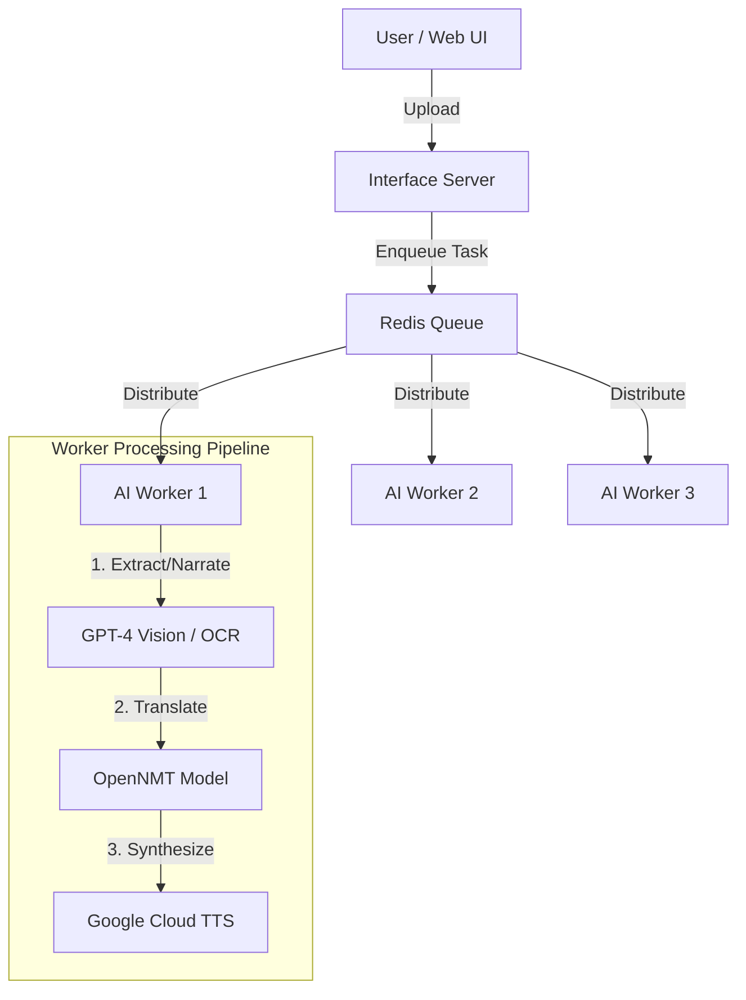

# Comic-to-Speech 🎭📚🔊

AI-powered comic book narration system that transforms visual comics into immersive audiobook experiences using GPT-4 Vision, Google Cloud TTS, and Neural Machine Translation.

## Features

- **🎭 Cinematic Narration**: GPT-4 Vision creates audiobook-style narration with dialogue and scene descriptions.
- **🌐 Neural Translation**: Optional English to Dutch translation using a fine-tuned OpenNMT Transformer.
- **🔊 Text-to-Speech**: High-quality Google Cloud TTS with multiple character voices.
- **⚡ Distributed Architecture**: Redis-based task queue with parallel AI workers.
- **🐳 Docker Ready**: Full containerized setup for easy deployment.

## Demo

[](https://youtu.be/7g8XIVirimQ)

Watch the system in action: [Comic-to-Speech Demo](https://youtu.be/7g8XIVirimQ)

## Architecture



## Quick Start

### Prerequisites
- **Docker** & **Docker Compose**
- **OpenAI API Key** (for GPT-4 Vision)
- **Google Cloud Credentials** (JSON file for Vision/TTS)

### 1. Setup
```bash
git clone https://github.com/EliasSchlie/comic-to-speech
cd comic-to-speech

# Setup credentials
cp path/to/your/credentials.json credentials.json

# Configure environment
cp .env.example .env
# Edit .env and add your OPENAI_API_KEY
```

### 2. Translation Model (Important)
The translation model (~1GB) is not in the repo. 
1. Download from [Google Drive](https://drive.google.com/file/d/1yEbxA-JgA2Dq-uELBoZITTPT0o3pKXBy/view?usp=share_link).
2. Copy **only the model files** (not `.py` files) into the `model/` folder.
   - Copy: `model_step_22000.pt`, `bpe.model`, and other data files
   - **Do NOT copy** `.py` files - these are already in the repo

### 3. Run with Docker (Recommended)
This starts the Redis orchestrator, Interface server, and AI Workers.

```bash
cd docker
docker-compose up --build -d
```

Access the web interface at **http://localhost:5001**.

### Managing Services

```bash
# View logs (from docker/ directory)
docker-compose logs -f

# Stop services
docker-compose down

# Rebuild after changes
docker-compose up --build -d
```

## Configuration

| Variable | Description | Default |
|----------|-------------|---------|
| `OPENAI_API_KEY` | Required for LLM narration | - |
| `GOOGLE_APPLICATION_CREDENTIALS` | Path to GCP JSON key | `credentials.json` |
| `USE_LLM_NARRATOR` | `true` for GPT-4, `false` for OCR only | `true` |
| `REDIS_HOST` | Redis hostname | `localhost` |

## Testing

The project includes a comprehensive test suite covering unit tests, integration tests, and edge cases.

### Setup Test Environment

```bash
# Using uv (recommended)
uv add --dev pytest pytest-mock pillow

# Or using pip
pip install pytest pytest-mock pillow
```

### Running Tests

```bash
# Run all tests
uv run pytest tests/ -v

# Run with detailed output
uv run pytest tests/ -v --tb=short

# Run specific test file
uv run pytest tests/test_interface_unit.py -v

# Run specific test
uv run pytest tests/test_pipeline_integration.py::test_full_pipeline_with_translation -v

# Run tests including expensive API calls (skipped by default)
uv run pytest tests/test_extreme_cases.py::test_ocr_with_actual_black_image -v
```

### Test Coverage

| Test File | Tests | Type | What We Test |
|-----------|-------|------|---------------|
| `test_interface_unit.py` | 6 | **Unit** | File upload validation: presence checks, file type restrictions (jpg/png/gif/webp), 10MB size limit with exact boundary conditions |
| `test_llm_narrator_unit.py` | 4 | **Unit** | ComicNarrator class: API key validation, base64 image encoding, prompt generation with/without panel context, OpenAI API error handling |
| `test_tasks_unit.py` | 13 | **Unit** | Individual task functions: OCR extraction success/failure, translation with None/empty inputs, TTS validation and client initialization failures |
| `test_pipeline_integration.py` | 5 | **Integration** | Full pipeline orchestration: data flow between OCR→Translation→TTS, graceful degradation on failures, correct text routing (original vs translated) |
| `test_extreme_cases.py` | 5 (1 skipped) | **Edge Cases** | Unusual scenarios: empty OCR results, translation unavailable, TTS quota exceeded, parallel execution smoke test, **skipped**: real black image OCR (requires API credentials) |
| `test_translation_integration.py` | 8 (2 skipped) | **Integration** | Translation system: pytest override behavior, EN→NL translation, empty/whitespace handling, long text support, **skipped**: subprocess timeout/failure (pytest override prevents testing) |

### Test Strategy

**Unit Tests** (`test_interface_unit.py`, `test_llm_narrator_unit.py`, `test_tasks_unit.py`)
- Test individual functions in isolation
- Mock all external dependencies (APIs, file I/O)
- Focus on validation logic, error handling, edge cases
- Fast execution, no API costs

**Integration Tests** (`test_pipeline_integration.py`, `test_translation_integration.py`)
- Test how components work together
- Mock external APIs but test real orchestration logic
- Verify data flows correctly between stages
- Test graceful degradation (fallbacks when services fail)

**Edge Case Tests** (`test_extreme_cases.py`)
- Test unusual scenarios that may occur in production
- Include one real API test (skipped by default)
- Test boundary conditions and stress scenarios
- Note: Parallel execution test uses mocks (doesn't catch real race conditions)

## Project Structure

> **📝 Note**: All main Python files contain detailed docstrings explaining their purpose, architecture role, and key functions. Use `help(module_name)` or read the module headers for comprehensive documentation.

### Core Application Modules

| Module | Purpose |
|--------|---------|
| `server/` | **Web Interface** - Flask server with UI and API endpoints. Handles uploads and job queuing. |
| `workers/` | **Task Processing** - Worker processes and task definitions for distributed AI execution. |
| `narration/` | **Text Extraction** - LLM-based narration (GPT-4 Vision) and OCR fallback (Google Vision). |
| `translation/` | **Language Translation** - Neural machine translation (EN→NL) using OpenNMT. |
| `ocr/` | **Advanced OCR** - Speech bubble detection and panel ordering utilities. |
| `config.py` | **Central Configuration** - Environment variables and system defaults. |

### Key Files

| File | Purpose |
|------|---------|
| `server/interface_server.py` | Flask web server that enqueues jobs to Redis queue. |
| `workers/worker.py` | Worker entry point that consumes and executes tasks from Redis. |
| `workers/tasks.py` | Task function definitions (OCR, translation, TTS, full pipeline). |
| `narration/llm_narrator.py` | GPT-4 Vision integration for cinematic narration. |
| `narration/vision_ocr.py` | Google Cloud Vision OCR fallback. |
| `translation/translator.py` | OpenNMT-based translation module (EN→NL). |

### Infrastructure

| File / Folder | Purpose |
|---------------|---------|
| `docker/` | **Docker Configuration** - All containerization files. |
| `docker/docker-compose.yml` | Orchestrates Redis, Interface Server, and 3 AI Workers. |
| `docker/Dockerfile.interface` | Container definition for the web interface server. |
| `docker/Dockerfile.worker` | Container definition for AI worker processes. |
| `requirements.txt` | Python dependencies for the entire system. |

### Data & Assets

| Folder | Purpose |
|--------|---------|
| `model/` | OpenNMT translation model weights (~1GB, gitignored, download separately). |
| `audio_files/` | Generated audio outputs (MP3 files). |
| `temp_images/` | Temporary storage for uploaded images during processing. |
| `comics/` | Example comic images for testing. |
| `tests/` | Unit and integration test suites. |

## Troubleshooting

- **Services won't start**: Check `docker-compose logs`. Ensure `model/` folder is populated if building workers.
- **No Audio**: Verify GCP credentials and TTS API enablement.
- **Queue Stuck**: Check Redis connection (`docker logs comic_redis_orchestrator`).

## License
Educational purpose only.
